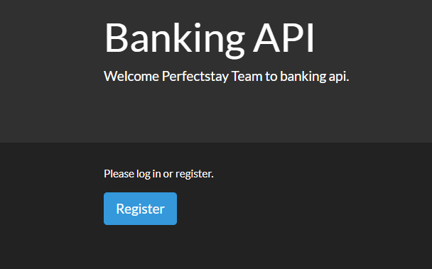
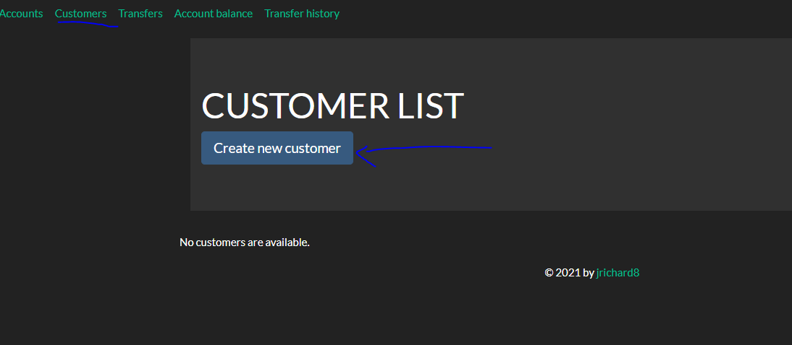
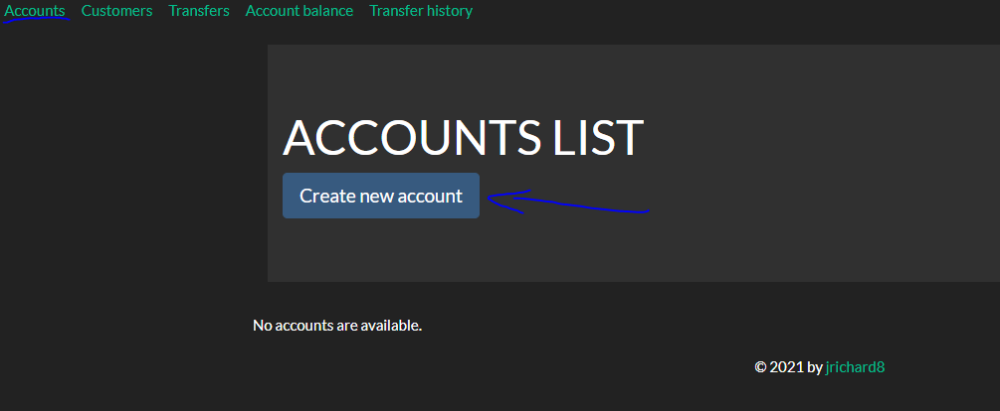
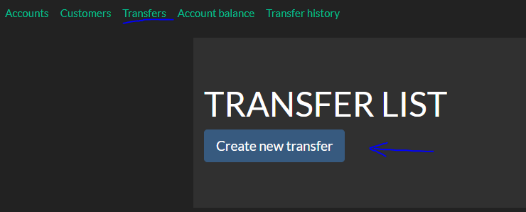
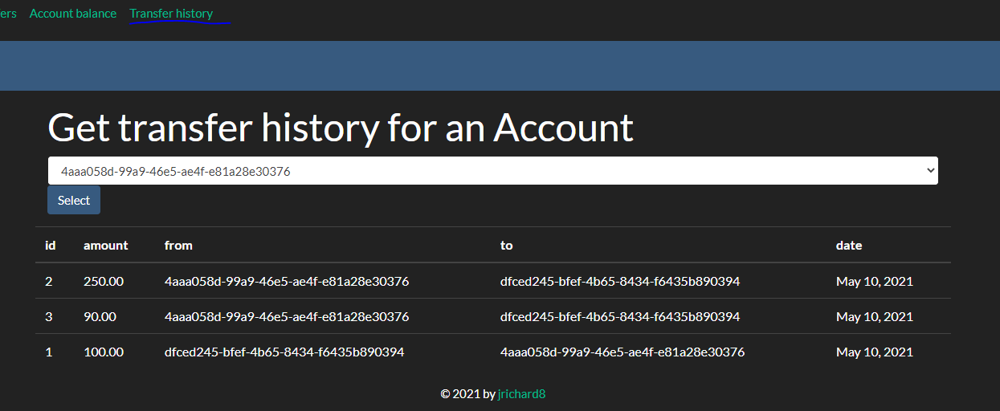
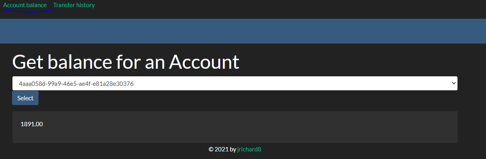

# Banking API

## Install Required Packages
```shell
 pip install -r requirements.txt
```

## Running the Application
Go to into the banking API app
```shell
cd banking_management
```
Before running the application we need to create the needed DB tables:
```shell
./manage.py migrate
```
Now you can run the development web server:
```shell
./manage.py runserver
```

## User Manual
* Register as a new user:
  
  
* Login with your user
  
* Create some customers:
  
  
* Create an account attached to a customer:
  
  
* Make some transfers between two accounts:
  * you have to follow some rules:
    * Account "from" and "to" should be different
    * The amount of the transfer should <= of the customer balance
  

* You can now look at the transfer history for a given account:
  
  
* And finally check balance for a given account:
  

#Conclusion

Hope you enjoyed reading.
I had fun coding this application but I'm not to my advantage since I've never used Django before
I'm more used to using the framework like [Flask](https://flask.palletsprojects.com/en/1.1.x/) or [Fast API](https://fastapi.tiangolo.com/)
Thanks.

----------------------------------------
### Objective

Your assignment is to build an internal API for a fake financial institution using Python and Django.

### Brief

While modern banks have evolved to serve a plethora of functions, at their core, banks must provide certain basic features. Today, your task is to build the basic HTTP API for one of those banks! Imagine you are designing a backend API for bank employees. It could ultimately be consumed by multiple frontends (web, iOS, Android etc).

### Tasks

- Implement assignment using:
  - Language: **Python**
  - Framework: **Django**
- There should be API routes that allow them to:
  - Create a new bank account for a customer, with an initial deposit amount. A
    single customer may have multiple bank accounts.
  - Transfer amounts between any two accounts, including those owned by
    different customers.
  - Retrieve balances for a given account.
  - Retrieve transfer history for a given account.
- Write tests for your business logic

Feel free to pre-populate your customers with the following:

```json
[
  {
    "id": 1,
    "name": "Arisha Barron"
  },
  {
    "id": 2,
    "name": "Branden Gibson"
  },
  {
    "id": 3,
    "name": "Rhonda Church"
  },
  {
    "id": 4,
    "name": "Georgina Hazel"
  }
]
```

You are expected to design any other required models and routes for your API.

### Evaluation Criteria

- **Python** best practices
- Completeness: did you complete the features?
- Correctness: does the functionality act in sensible, thought-out ways?
- Maintainability: is it written in a clean, maintainable way?
- Testing: is the system adequately tested?
- Documentation: is the API well-documented?

### CodeSubmit

Please organize, design, test and document your code as if it were going into production - then push your changes to the master branch. After you have pushed your code, you may submit the assignment on the assignment page.

All the best and happy coding,

The Perfectstay Team